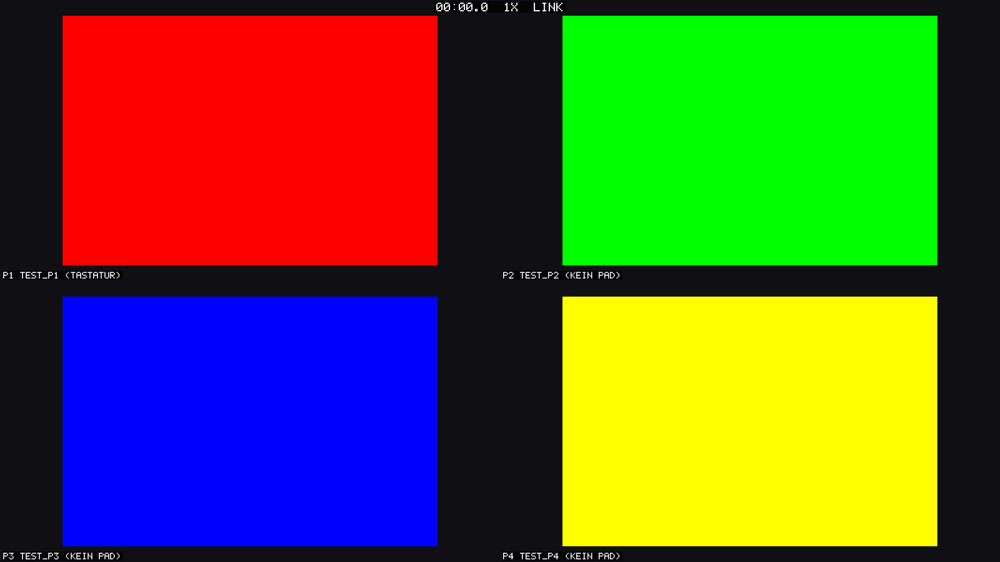

# SplitGBA — Deutsche Anleitung

**4-Spieler-Splitscreen-GBA-Emulator für den Fernseher** — mit Link-Kabel,
Race-Timer und globaler Tempo-Regelung (1x–4x).

English README: [README.md](README.md)



Gedacht für Pokémon-Abende mit Freunden: alle sehen den Stand der anderen,
ihr könnt auf Zeit spielen, das Tempo hochdrehen und dank emuliertem
Link-Kabel Pokémon tauschen oder gegeneinander kämpfen. Basiert auf dem
[mGBA](https://mgba.io)-Emulator-Core; die Link-Verbindung nutzt exakt
denselben Lockstep-Mechanismus wie das offizielle mGBA-Multiplayer-Feature.

> **Wichtig:** Es sind keine Spiele enthalten. Verwendet nur ROM-Dateien,
> die ihr von euren eigenen Modulen gesichert habt.

## Bauen

Einmalig nötig: Xcode Command Line Tools sowie [Homebrew](https://brew.sh)
mit `cmake` und `sdl2` (`brew install cmake sdl2`).

```bash
git clone --recursive https://github.com/JosipFX/splitgba.git
cd splitgba
./build.sh
```

Der mGBA-Core liegt als Git-Submodule bei und wird automatisch als statische
Bibliothek mitgebaut. Ergebnis: `./build/splitgba`

## Starten

```bash
# 4 verschiedene Editionen (z.B. zum Tauschen):
./build/splitgba -f feuerrot.gba blattgruen.gba rubin.gba smaragd.gba

# 4x dasselbe Spiel — Wettrennen! Jeder Spieler bekommt einen eigenen Spielstand:
./build/splitgba -f -n 4 feuerrot.gba

# Alle .gba-Dateien aus einem Ordner (alphabetisch, max. 4):
./build/splitgba -f roms/

# Zum Ausprobieren ohne echte ROMs (bunte Testbildschirme):
python3 tools/make_test_rom.py
./build/splitgba roms-test/
```

`-f` startet direkt im Vollbild — das wollt ihr am TV.

### Optionen

| Option | Wirkung |
|---|---|
| `-f`, `--fullscreen` | Vollbild starten |
| `-n <1-4>` | ein ROM mehrfach starten (eigener Spielstand pro Spieler) |
| `--speed <1-4>` | Start-Tempo |
| `--no-link` | Link-Kabel deaktivieren |
| `--smooth` | weiche Skalierung statt scharfer Pixel |
| `--mute` | ohne Ton starten |

## Tasten (Hotkeys für alle)

| Taste | Funktion |
|---|---|
| `1`–`4` oder `F1`–`F4` | Tempo 1x / 2x / 3x / 4x (gilt für alle Spieler) |
| `Tab` (halten) | Turbo 4x, solange gedrückt |
| `Leertaste` | Race-Timer starten / stoppen |
| `R` | Timer auf 0 |
| `Shift`+`R` | **alle Spiele neu starten** + Timer auf 0 (Race-Start) |
| `P` | Pause (alle) |
| `M` | Ton durchschalten: alle → nur P1 → … → nur P4 → stumm |
| `F5` / `F9` | Savestate für alle speichern / laden |
| `F` | Vollbild an/aus |
| `H` | Anzeigen (HUD) ein/aus |
| `Esc` | Beenden |

## Controller

Einfach anschließen (USB oder Bluetooth) — Xbox-, PlayStation-, Switch-Pro-
und 8BitDo-Controller funktionieren direkt. **Reihenfolge des Verbindens =
Spieler-Reihenfolge**: der erste Controller steuert Spieler 1, der zweite
Spieler 2 usw. An- und Abstecken geht auch während des Spielens.

Belegung: Schultertasten = L/R, Start/Menü = Start, Select/Share = Select,
D-Pad oder linker Stick.

**Spieler 1 kann zusätzlich mit der Tastatur spielen:**
Pfeiltasten, `X` = A, `Z` oder `Y` = B, `A` = L, `S` = R,
`Enter` = Start, `Rückschritt` = Select.

Liegt eine `gamecontrollerdb.txt`
([SDL-Community-Datenbank](https://github.com/mdqinc/SDL_GameControllerDB))
im Startverzeichnis, wird sie automatisch geladen (für exotische Controller).

### Nintendo Switch Pro Controller

Wird nativ unterstützt (SDL-HIDAPI-Treiber), per USB-C-Kabel **oder**
Bluetooth — keine Zusatzdatei nötig. Bluetooth-Kopplung am Mac: kleinen
Sync-Knopf oben am Controller gedrückt halten, bis die LEDs lauflichtern,
dann in *Systemeinstellungen → Bluetooth* verbinden. Die Tastenbeschriftung
zählt: die mit **A beschriftete Taste ist GBA-A** (Bestätigen), B ist B —
fühlt sich also genau wie am GBA an.

Schnelltest, ob alle Controller erkannt sind:

```bash
./build/splitgba --list-pads
```

Kompletter Probelauf ohne echte Spiele: `./build/splitgba roms-test/` —
jede Kachel blinkt weiß, sobald auf dem zugehörigen Controller ein Knopf
gedrückt wird.

## Pokémon tauschen & kämpfen

Das Link-Kabel ist immer aktiv (außer mit `--no-link`). Zum Tauschen geht
in beiden Spielen in den **Kabelclub im Pokémon-Center** (obere Etage) —
genau wie am echten Gerät. Gen-3-Spiele (Rubin/Saphir/Smaragd/Feuerrot/
Blattgrün) können untereinander tauschen; Feuerrot/Blattgrün brauchen dafür
den Nationaldex (nach der Top Four).

Tipps:
- Beim Tauschen/Kämpfen aufs Tempo **1x** zurückschalten — stabiler.
- `F5`/`F9` (Savestates) **nicht mitten in einer Link-Übertragung** benutzen.
- Spielstände (`.sav`) liegen neben den ROMs. Bei `-n` (gleiches ROM mehrfach)
  bekommt jeder Spieler automatisch `spiel.p1.sav`, `spiel.p2.sav` usw.

## Race-Modus (auf Zeit spielen)

1. `./build/splitgba -f -n 4 spiel.gba`
2. Alle bereit? `Shift`+`R` — alle Spiele starten synchron neu.
3. `Leertaste` startet den Timer (läuft groß im HUD mit, bei 3 Spielern
   in der freien Bildschirm-Ecke).
4. Tempo nach Absprache: `2` für 2x macht lange Grind-Phasen erträglicher —
   gilt immer für alle, niemand kann heimlich vorspulen.

## Bekannte Grenzen

- Nur GBA-Spiele (keine GB/GBC-Module).
- Ein Tastatur-Spieler; Spieler 2–4 brauchen Controller.
- Savestate-Laden während einer laufenden Link-Übertragung kann die
  Verbindung stören (dann hilft `Shift`+`R`).
- GBA-Spiele erlauben Tausch/Kampf nur zwischen kompatiblen Editionen —
  dieselben Regeln wie mit echten Link-Kabeln.
- Entwickelt und getestet auf macOS (Apple Silicon); Linux ist ungetestet.

## Lizenz

Eigener Code: [MIT](LICENSE). Der eingebettete mGBA-Core
(`third_party/mgba`) steht unter der Mozilla Public License 2.0.
